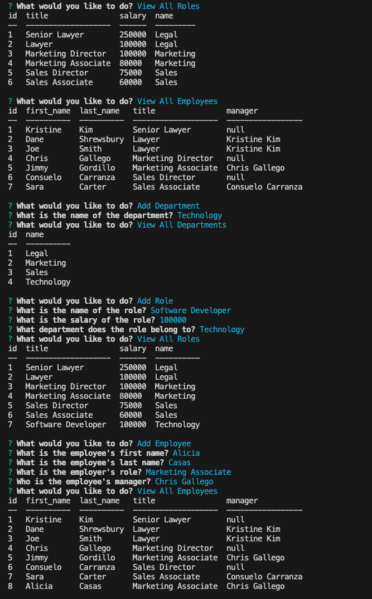

# Employee Tracker
> This is a command-line application to manage a company's employee database, using Node.js, Inquirer, and MySQL.
> Walkthrough Video [_here_](https://drive.google.com/file/d/1CXIKChXnqI6IN1YB4u2BUT9imzVp2cL-/view). <!-- If you have the project hosted somewhere, include the link here. -->

## Table of Contents
* [General Info](#general-information)
* [Technologies Used](#technologies-used)
* [Features](#features)
* [Screenshots](#screenshots)
* [Setup](#setup)
* [Usage](#usage)
* [Project Status](#project-status)
* [Room for Improvement](#room-for-improvement)
* [Acknowledgements](#acknowledgements)
* [Contact](#contact)
<!-- * [License](#license) -->

## General Information
This is a command-line application to access a company's employee database.  When the user clicks on View All Departments, View all Roles, or View all Employees, a table showing that information is displayed.  The user can click on Add Department, Add Role, or Add Employee which will prompt additional questions about the information to add a department, role, or employee. Then, click on View Departments, Roles, or Employees to see it included in the table.  The user can also go to Update Employee Role to change the role of an existing employee which will also be updated and able to view on the employee table.
<!-- You don't have to answer all the questions - just the ones relevant to your project. -->

## Technologies Used
- console.table 0.10.0
- dotenv "^8.2.0"
- inquirer ^8.2.4
- mysql2 ^2.2.5
- util ^0.12.5
- node.js

## Features
- View tables with database information by clicking on View All Departments, Roles, or Employees. 
- Click on Add Department, Role, or Employee to be prompted with additional questions that will add the information to the corresponding table.
- Click on Update Employee Role to be prompted with additional questions and that information will be updated in the employee table.

## Screenshots

<!-- If you have screenshots you'd like to share, include them here. -->

## Setup
In order to use this application, the following are required:
- Node.js
- Node package modules
- Inquirer 8.2.4
- MySQL
- console.table 
- dotenv
- util

## Usage

`npm i`

`npm run start`

`node app.js`

## Project Status
Project is: _in progress_.

## Acknowledgements
- Many thanks to my instructor, Michael Pacheco, the TAs, Nirav and Julius, tutor Dane Shrewsbury, and all the AskBCS learning assistants.

## Contact
Created by Kristine Kim.  Feel free to contact me at kristinehkim@gmail.com!

<!-- Optional -->
<!-- ## License -->
<!-- This project is open source and available under the [... License](). -->

<!-- You don't have to include all sections - just the one's relevant to your project -->